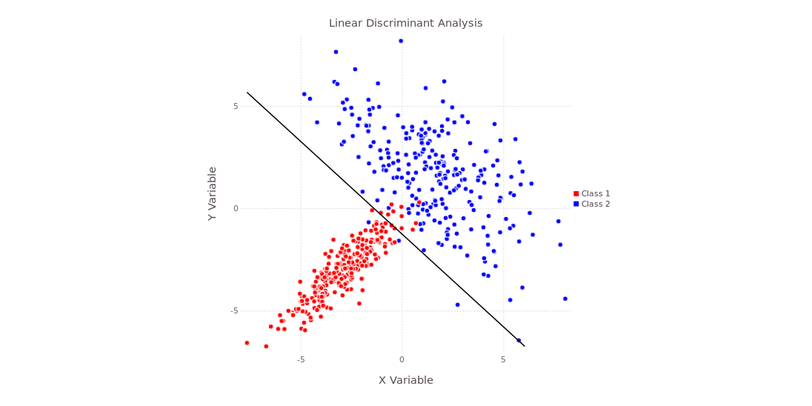
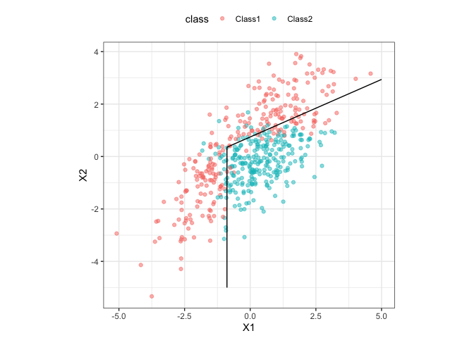

## **Discriminant Function Analysis (DFA)**

-   Discriminant Function Analysis (DFA) is a statistical method that identifies combinations of features that best separate predefined groups.
-   It works by finding new axes (called discriminant functions) that maximize the separation between groups while minimizing variation within groups.
-   DFA is useful for:
    1.  Classification problems
    2.  Dimensionality reduction
    3.  Understanding which variables drive group differences

### Discriminant analysis methods

We explore three related approaches:

1.  **Linear Discriminant Analysis (LDA):** This assumes that all classes share a common covariance structure and produces linear decision boundaries. This makes the model simple, stable, and interpretable.

    

2.  **Quadratic Discriminant Analysis (QDA):** This relaxes this assumption by allowing each class to have its own covariance matrix, resulting in nonlinear (quadratic) decision boundaries. More flexible.

3.  **Flexible Discriminant Analysis (FDA):** This extends LDA by incorporating nonlinear transformations, enabling more complex decision boundaries at the cost of reduced interpretability.



### About the {DFATools} Package:

-   `prepare_data()`: Prepares data for modeling.
-   `run_lda_model()`: Runs LDA model.
-   `run_qda_model()`: Runs QDA model.
-   `run_fda_model()`: Runs FDA model.
-   `plot_confusion_matrix()`: Plots a confusion matrix.

## Background - Dataset

-   Music genres are categories that classify tracks based on shared audio characteristics such as acousticness, energy, and rhythm. However, with modern datasets containing hundreds of overlapping genres, formal classification can become complex.
-   To streamline this process, we developed the {DFATools} package, which provides an integrated workflow for data preparation, modeling, and evaluation.

## Research questions:

-   Can we accurately classify music into broad genre groups using audio features?
-   Do genre categories differ significantly in their audio characteristics?
-   Which specific audio features contribute most significantly to the discrimination between genres?

## Data description

The dataset contains information about Spotify tracks from 114 different genres, originally curated by Maharshi Pandya (via [Hugging Face](https://huggingface.co/datasets/maharshipandya/spotify-tracks-dataset)) and hosted on [Kaggle](https://www.kaggle.com/datasets/thedevastator/spotify-tracks-genre-dataset/data). There are 19 variables in the dataset, including `artist` (name of the track artist), `album_name` (the album the track is from), `track_name` (name of the track), `popularity` (the popularity of the track on Spotify from 0 - 100), `duration_ms` (length of the track in milliseconds, `track_genre` (the genre of the track), as well as variables for audio attributes.

{fig-align="center" width="257"}

### Preliminaries

```{r}
# Loading in necessary packages

library(DFATools)
library(tidyverse)
library(caret)
library(corrplot)
library(knitr)
library(mda)
```

### Loading the dataset

```{r}
df <- read_csv("https://raw.githubusercontent.com/sandanihk/collaborative-datascience-project/refs/heads/main/Spotify%20Tracks%20Genre.csv", col_names = TRUE)
```

### 1. Feature Selection

To begin the analysis, the numeric predictor variables are selected. 5 key audio features: energy, acousticness, speechiness, danceability, and instrumentalness, were selected from the dataset to serve as predictors.

This selection was made to maximize the variance explained across the dimensions of music composition while minimizing multicollinearity. By excluding redundant variables (e.g., loudness), we ensure that the DFA identifies significant boundaries between genre groups.

```{r}
# Creating a vector for selected audio features

audio_features <- c(
  "energy",
  "acousticness",
  "speechiness",
  "danceability",
  "instrumentalness"
)
```

### 2. Genre Grouping

To reduce the complexity of the classification task, certain genres were grouped into broader categories to improve class separability and interpretability.

```{r}
# Filtering the genres of interest and grouping them

df_grouped <- df %>%
 filter(track_genre %in% c(
    "rock", "metal", "hard-rock", "punk", "alternative",
    "pop", "hip-hop", "dance", "house", "techno",
    "acoustic", "classical", "jazz", "folk", "blues"
  )) %>%
  mutate(genre_group = case_when(
    track_genre %in% c("rock", "metal", "hard-rock", "punk", "alternative") ~ "Rock & Metal",
    track_genre %in% c("pop", "hip-hop", "dance", "house", "techno") ~ "Electronic & Pop",
    track_genre %in% c("acoustic", "classical", "jazz", "folk", "blues") ~ "Acoustic & Traditional"
  ))
```

The dataset includes 114 genre labels, many of which exhibit high stylistic overlap. To ensure statistical robustness, we focused the analysis on 15 of the most popular genres aggregated into three broad categories: "Rock & Metal", "Electronic & Pop", and "Acoustic & Traditional."

**Checking group balance**

For the analysis, we should ensure that each class has approximately similar number of observations to avoid biased model training.

```{r}
# Determining the amount of data in each group

df_grouped %>%
  count(genre_group) %>%
  arrange(desc(n))
```

### 3. Selecting the features chosen from the grouped dataset

Here, the final dataset is constructed for the analysis, containing the predictors (i.e., the audio features) and the categorical target variable (i.e, grouped genre).

```{r}
# Subsetting the dataset using defined audio features and target variable

df_model <- df_grouped %>%
  dplyr::select(all_of(audio_features), genre_group) %>%
  na.omit() 

```

### 4. Function for preparing the data

The `prepare_data()` function combines several preprocessing steps into one workflow: removing missing values, converting the response variable into a factor, splitting the data into training and testing sets, and optionally standardizing the predictors.

To evaluate model generalization, the dataset is split into training and testing sets. To ensure all predictor variables contribute equally the discriminant functions, they are standardized (centered and scaled) with `caret::preProcess`.

```{r}
prepare_data <- function(data, target_column_name, training_propotion_size, scale = TRUE, seed = 123) {

  set.seed(seed)

  # First removing missing values in the data
  data <- tidyr::drop_na(data)

  # Keeping the target variable as a factor
  data[[target_column_name]] <- as.factor(data[[target_column_name]])

  # Then splitting the dataset to train and test sets
  train_index <- caret::createDataPartition(
    data[[target_column_name]],
    p = training_propotion_size,
    list = FALSE
  )

  training_set_raw <- data[train_index, ]
  test_set_raw  <- data[-train_index, ]

  # Cleaning unused factor levels in the target variable for both train and test sets

  training_set_raw[[target_column_name]] <- droplevels(training_set_raw[[target_column_name]])
  test_set_raw[[target_column_name]]  <- droplevels(test_set_raw[[target_column_name]])


  # Here, Caret's preProcess function is used to center and scale the numeric predictors based on the training data, and then apply the same transformations to the test data.

  if (scale) {

    training_predictors <- dplyr::select(
      training_set_raw,
      -dplyr::all_of(target_column_name)
    )

    test_predictors <- dplyr::select(
      test_set_raw,
      -dplyr::all_of(target_column_name)
    )

    preprocess_object <- caret::preProcess(
      training_predictors,
      method = c("center", "scale")
    )

    training_set_scaled <- predict(preprocess_object, training_predictors)
    test_set_scaled <- predict(preprocess_object, test_predictors)

    final_training_data <- training_set_scaled
    final_training_data[[target_column_name]] <- training_set_raw[[target_column_name]]

    final_test_data <- test_set_scaled
    final_test_data[[target_column_name]] <- test_set_raw[[target_column_name]]

  } else {
    final_training_data <- training_set_raw
    final_test_data  <- test_set_raw
    preprocess_object <- NULL
  }

  return(list(
    training_data = final_training_data,
    test_data = final_test_data,
    preprocess_object = preprocess_object
  ))
}
```

For DFA, the response variable (`genre_group)` should be converted into a factor to ensure compatibility with classification models, as this will correctly identify the groupings and allow proper matrix partitioning.

#### Train/Test Split

70% of the data are used for training while 30% are used for testing. By allocating 70% of the observations to the training set, the DFA has enough data to estimate how each feature varies and how features relate to each other, which is needed to define stable discriminant functions. The 30% is used to evaluate the model's predictive accuracy on unseen data. This ratio ensures that the testing phase is statistically meaningful, providing enough samples to generate a confusion matrix, without depriving the training step of data needed to capture underlying patterns in the grouped genres. A train/test ratio of 80/20 would have also been ideal.

#### Standardizing the Predictors

DFA is sensitive to the scale of inputs; variables with larger absolute values can disproportionately influence how the model captures relationships between features, which may mask the contributions of variables on smaller scales. By transforming each predictor to have a mean of zero and a standard deviation of one, we ensure that the model identifies patterns based on the statistical relationship of the features rather than their arbitrary units of measurement. Notably, the scaling parameters were derived from the training set and then applied to the test set to prevent any data leakage.

Standardization is optional in this function. If `scale = FALSE`, the function returns the original unscaled training and testing data.

Below is an example of how you can call the function:

```{r}
training_and_test_data<- prepare_data(df_model, "genre_group", 0.7, scale = TRUE, seed = 123)
training_and_test_data
```

#### 5. Correlation Analysis

Here, we are checking for correlation among predictors, which can negatively affect discriminant analysis.

```{r}
# Computing correlation matrix for predictor variables

cor_matrix <- cor(training_and_test_data$training_data %>% dplyr::select(-genre_group))

# Visualizing correlations as a heatmap

corrplot(cor_matrix, method = "color", tl.cex = 0.7)

# Identifies highly correlated predictors
high_corr <- caret::findCorrelation(cor_matrix, cutoff = 0.90)

# If the correlation is high, variable removal may be necessary
kable(data.frame(
  Metric = "Identified highly correlated predictors",
  Value = length(high_corr)
))
```

In DFA, highly redundant variables can lead to unstable coefficient estimates and variance, as it would struggle to uniquely identify attributes for group separation on specific features. A correlation matrix was generated and visualized as a heatmap to identify pairwise relationships exceeding the cutoff of 0.90. Using `caret::findCorrelation` allowed us to visualize that no predictors met this threshold (there was no colored squared that indicated \> 0.90 between the predictors in our case). This confirms that each audio feature provides unique information, allowing the model to use dataset without redundancy.

### 6. MANOVA Test

To evaluate whether the three genre groups differ in their combined audio feature profiles, a MANOVA was conducted using a Wilks' Lambda test statistic. Unlike univariate ANOVAs, MANOVA takes the correlation between predictors into account simultaneously, allowing for a more holistic overview and assessment of group separation. Wilks' Lambda test statistics look at the proportion of total variance not described by the group differences.

```{r}
# Performing MANOVA to test whether genre groups differ across audio features

manova_model <- manova(
  as.matrix(training_and_test_data$training_data %>% dplyr::select(-genre_group)) ~ genre_group,
  data = training_and_test_data$training_data
)
# Summarizing MANOVA results using Wilks' Lambda test

summary(manova_model, test = "Wilks")
```

For our case, the MANOVA test results were highly significant (p \< 2.2e-16), indicating that genre groups differ in their combined audio features. The relatively low Wilks’ Lambda (0.412) suggests that about 59% of the variance in the audio features can be explained by the differences in the genre groups. Additionally, this low value provides statistical justification to perform a DFA to model these differences.

### 7. Running an LDA Model

With a significant MANOVA confirming group differences, an LDA is fitted to the to the training data to classify the groups (i.e. genres). LDA creates linear combination of the predictors to maximize the ratio of between-group to within-group variance.

Using the `run_lda_model()` function from the {**DFATools} package**, we fit the model and evaluate its performance on a held-out test set:

```{r}
# Running LDA function

run_lda_model <- function(training_data, test_data, target_column_name) {

  # Creating the formula for the model
  formula <- stats::as.formula(paste(target_column_name, "~ ."))

  # Fitting the LDA model usign training data
  model <- MASS::lda(formula, data = training_data)

  # Leave-One-Out Cross-Validation on training data
  cv_model <- MASS::lda(
    formula,
    data = training_data,
    CV = TRUE
  )

  # Computing cross-validation accuracy
  cv_accuracy <- mean(cv_model$class == training_data[[target_column_name]])

  # Predicting on test data
  predictions <- predict(model, newdata = test_data)

  # Accuracy evaluation using confusion matrix
  confusion_matrix <- caret::confusionMatrix(
    predictions$class,
    test_data[[target_column_name]]
  )

  # Extracting test accuracy
  accuracy <- confusion_matrix$overall["Accuracy"]

  # Projecting training data onto discriminat axes
  
  lda_values <- predict(model, newdata = training_data)
  lda_df <- as.data.frame(lda_values$x) # Converting into data frame
  lda_df[[target_column_name]] <- training_data[[target_column_name]]

  # Creating visualization if two discriminant axes exist
  if (ncol(lda_values$x) >= 2) {

    plot <- ggplot2::ggplot(
      lda_df,
      ggplot2::aes(x = LD1, y = LD2, color = .data[[target_column_name]])
    ) +
      ggplot2::geom_point(alpha = 0.6, size = 0.8) +
      ggplot2::theme_minimal() +
      ggplot2::labs(
        title = "LDA Visualization (LD1 vs LD2)",
        x = "Linear Discriminant 1",
        y = "Linear Discriminant 2",
        color = target_column_name
      )

    # If only one axis exists, a plot is not created
  } else {
    plot <- NULL # If this is the case, you can somply plot the x variable against the y variable as a scatterplot
  }

  # Returning relevant outputs as a list
  return(list(
    model = model,
    predictions = predictions,
    confusion_matrix = confusion_matrix,
    accuracy = accuracy,
    cv_model = cv_model,
    cv_accuracy = cv_accuracy,
    coefficients = model$scaling,
    plot = plot
  ))
}
```

#### Cross Validation

To further assess the discriminant functions, Leave-One-Out Cross-Validation (LOOCV) is done. In this iterative process, the model is trained using all observations except one, which is then used as the single-item "test set" to examine classification accuracy. This process is repeated until every observation serves as the validation point; thus, the number of rounds is determined by the sample size.

#### Model Evaluation on Test Data

To determine the real-world utility of the discriminant functions, the model is used to predict the genres of the independent test set (30%; `test_data`). This step is important for verifying that the patterns from the training phase is generalizable to the new, unseen test data.

#### LDA Visualization

To visualize the group separation achieved from the model, the training observations (`train_data`) are projected onto two discriminant axes (Linear Discriminant 1 vs. Linear Discriminant 2). The resulting scatterplot, enhanced with 68% confidence ellipses, provides a spatial representation of how the model distinguishes the three groups.

Below is an example of how to run the LDA function:

```{r}
lda_results <- run_lda_model(training_and_test_data$training_data, training_and_test_data$test_data, "genre_group")

lda_results$model
lda_results$accuracy
lda_results$cv_accuracy
lda_results$plot
```

#### Cross-validation results

The LOOCV results yielded and accuracy of 0.703, showing that this model correctly classified \~71% of the observations. Since the cross validation accuracy is high, it suggests that the LDA model has captured generalizable musical patterns between the grouped genres!

The group means provide a profile of the audio characteristics that describe the grouped genres. The Acoustic & Traditional group was characterized by high acousticness (+0.919) and low energy (-0.818). The Electronic & Pop group showed higher danceability (+0.707) and slightly lower acousticness (-0.369). Lastly, Rock & Metal was defined by high energy (+0.551) and low acousticness (-0.550) and danceability (-0.374).

Ultimately, Rock & Metal represents high-energy, amplified music, Electronic & Pop captures rhythm-driven and dance-oriented styles, while Acoustic & Traditional includes organic, low-energy genres. This grouping is motivated by shared audio characteristics rather than strict genre labels, allowing the models to learn more coherent patterns.

#### LDA Visualization results

The LDA model constructed two linear discriminants to maximize group separation: LD1 and LD2. The primary axis LD1 explains 70% of between-group variance, showing that the groups' difference is driven mostly by acousticness (strong negative weight) and energy (strong positive weight). The second axis LD2 shows that the remaining 30% of between-group variance is influenced by danceability and speechiness (negative weights).

The x-axis (Linear Discriminant 1) served as the strongest separator, distinguishing Acoustic & Traditional from the more modern, high energy groups. The y-axis further refines the classification by separating the Rock & Metal and Electronic & Pop groups. While both groups are relatively high-energy , LD2 captures the nuanced differences in the rhythmic and vocal structure (i.e., danceability and speechiness).

It is important to note that there is overlap between the groups, as some tracks from different genres groups share similar audio characteristics. This proximity in the multivariate space accounts for the missclassification patterns observed in the confusion matrix. This suggests that while these genres are statistically distinct, they exist on a continuum rather than as entirely isolated categories.

#### Test accuracy results

The model achieved an accuracy of 70% on the test set, which is very close to the cross-validation accuracy (\~71%). This consistency suggests that the model generalizes well and is not overfitting, meaning that it learned the fundamental characteristics of the genres rather than memorizing.

Importantly, the accuracy was substantially higher than the No-Information rate (33%). This rate represents the accuracy expected from random guessing from a three-group dataset. The p-value is also significantly lower than 0.05. These results allow us to see that the LDA model performs better than chance, and that the audio features (specifically acousticness, energy, and danceability) are suitable predictors of musical genres.

### 8. Confusion Matrix Heatmap

To provide a view of model performance, a heatmap of the confusion matrix is generated. A confusion matrix compares the model's predicted classifications against the actual/true genre labels. This visualization translates the raw classification counts into a color-coded grid, where the intensity of the color represents the frequency of observations, the rows represent the predicted classes, and the columns are the true classes.

```{r}
# Plotting the confusion matrix

plot_confusion_matrix <- function(confusion_matrix, title = "Confusion Matrix Heatmap") {
  conf_df <- as.data.frame(confusion_matrix$table)

  ggplot2::ggplot(conf_df, ggplot2::aes(x = Reference, y = Prediction, fill = Freq)) +
    ggplot2::geom_tile() +
    ggplot2::geom_text(ggplot2::aes(label = Freq), size = 3) +
    ggplot2::scale_fill_gradient(low = "white", high = "steelblue") +
    ggplot2::theme_minimal() +
    ggplot2::theme(
      axis.text.x = ggplot2::element_text(angle = 45, hjust = 1)
    ) +
    ggplot2::labs(
      title = title,
      x = "True Class",
      y = "Predicted Class"
    )
}
```

This is an example of running the plotting the confusion matrix function:

```{r}
plot_confusion_matrix(lda_results$confusion_matrix, title = "LDA Confusion Matrix")
```

In the confusion matrix heatmap, there is a strong diagnol from the bottom-left to top-right, which represents correct classifications. The deep saturation shows that the majority of the tracks in the three categories were assigned to their true genre group, supporting high model precision. The light-shaded spaces reveal the points of confusion. As hypothesized, the most frequent misclassifications occur between Electronic & Pop and Rock & Metal. The heatmap confirms that these two genres are more likely to be mistaken from one another than for an Acoustic & Traditional track.

Ultimately, this visualization proves that while the discriminant functions are effective, the inherent blurring on genre boundaries is the primary constraint on their classification.

### 9. Feature Importance and Discriminant Coefficients

To understand the drives behind the model's classification, the standardized coefficients for the first two discriminants are analyzed. The coefficients represent the relative contribution of each audio feature to the different genre groups.

```{r}
# Extracting LDA scaling coefficients

lda_coeff <- lda_results$model$scaling

# LD1 importance table
ld1_importance <- data.frame(
  Feature = rownames(lda_coeff),
  LD1_Coefficient = lda_coeff[, 1]
) %>%
  arrange(desc(abs(LD1_Coefficient)))

kable(ld1_importance)

# LD2 importance table, if available
if(ncol(lda_coeff) >= 2){
  ld2_importance <- data.frame(
    Feature = rownames(lda_coeff),
    LD2_Coefficient = lda_coeff[, 2]
  ) %>%
    arrange(desc(abs(LD2_Coefficient)))
  
  kable(ld2_importance)
}
```

The coefficients for LD1 indicate that `acousticness` was the dominant features driving the primary axis of separation (carrying a large negative weight). On the other hand, `energy` contributes a strong positive weight. These results confirm that LD1 serves as an axis for musical characteristics like production intensity, effectively isolating Acoustic & Traditional tracks from more energetic, amplified genres. In this multivariate spaces, as `acousticness` decreases and `energy` increases, a track's probability of being classified as Rock & Metal or Electronic & Pop rises significantly.

The second discriminant function (LD2) provided the nuance to separate the other groups. This axis is driven mainly by `danceability`, with a strong negative coefficient. This indicates that LD2 is the primary tool for distinguishing dance-oriented genres like Electronic & Pop, from less dance-focused genres like Rock & Metal. Other features, such as `speechiness`, also contribute to the axis.

Overall, the model results demonstrate that genre separation can be structured along interpretable musical dimensions, with `acousticness` and `energy` defining the main axis of variation and `danceability` providing secondary differentiation.

### 10. QDA model

To evaluate whether a more flexible decision boundary would enhance classification, a QDA is fitted to the data. While LDA assumes that all genre groups share similar variability and relationships between features, QDA allows each group to have its own structure, providing a "curved" rather than linear boundary, which is better for capturing complex relationships between audio features.

```{r}
# Function to run QDA model and evaluate performance

run_qda_model <- function(training_data, test_data, target_column_name) {

  # Creating the formula for the model
  formula <- stats::as.formula(paste(target_column_name, "~ ."))

  # Fitting the QDA model using training data
  model <- MASS::qda(formula, data = training_data)

  # Leave-One-Out Cross-Validation on training data
  cv_model <- MASS::qda(
    formula,
    data = training_data,
    CV = TRUE
  )

  # Computing cross-validation accuracy
  cv_accuracy <- mean(cv_model$class == training_data[[target_column_name]])

  # Predict on test data
  predictions <- predict(model, newdata = test_data)

  # Accuracy evaluation using confusion matrix
  confusion_matrix <- caret::confusionMatrix(
    data = predictions$class,
    reference = test_data[[target_column_name]]
  )

  # Extracting overall test accuracy
  accuracy <- confusion_matrix$overall["Accuracy"]

  # Returning relevant outputs as a list
  return(list(
    model = model,
    predictions = predictions,
    confusion_matrix = confusion_matrix,
    accuracy = accuracy,
    cv_model = cv_model,
    cv_accuracy = cv_accuracy
  ))
}

```

This is an example of how to run the QDA model function:

```{r}
qda_results <- run_qda_model(training_and_test_data$training_data,training_and_test_data$test_data,"genre_group")

qda_results$model
qda_results$accuracy
qda_results$cv_accuracy
```

The QDA model yielded an accuracy of about 66%, which is lower than the LDA model (\~71%). This lower accuracy performance suggests that the added complexity of the QDA model may be leading to overfitting or that the assumption of equal covariance (required for LDA) is sufficiently met by this dataset.

```{r}
plot_confusion_matrix(qda_results$confusion_matrix, title = "QDA Confusion Matrix")
```

Additionally, the lower accuracy of the confusion matrix heatmap for the QDA model confirms that increasing the model flexibility does not always result in better predictive power.

For our case, a linear approach with LDA showed to be more robust and effective in capturing the true signal within the musical features, and remained the preferred model for our classification.

### 11. FDA model

FDA can be done to determine if non-linear transformations of the predictors could improve group separation. FDA is an extension of LDA and uses non-parametric regression to model the discriminant functions. This allows the model to capture more complex boundaries than a standard linear model might miss.

```{r}
# Function for running FDA model
run_fda_model <- function(training_data, test_data, target_column_name, cv_folds = 10, seed = 123) {

  # Setting seed for reproducibility
  set.seed(seed)

  # Creating model formual
  formula <- stats::as.formula(paste(target_column_name, "~ ."))

  # Fit FDA model on full training data
  model <- mda::fda(formula, data = training_data)

  # Create folds for k-fold cross-validation
  folds <- caret::createFolds(
    training_data[[target_column_name]],
    k = cv_folds,
    list = TRUE
  )

  # Initialize vector to store accuracy after each fold
  fold_accuracy <- numeric(length(folds))

  for (i in seq_along(folds)) {

    valid_index <- folds[[i]]

    cv_train <- training_data[-valid_index, ]
    cv_valid <- training_data[valid_index, ]

    cv_model <- mda::fda(formula, data = cv_train)

    cv_predictions <- predict(cv_model, newdata = cv_valid)

    fold_accuracy[i] <- mean(
      as.factor(cv_predictions) == cv_valid[[target_column_name]]
    )
  }

  # Computing average cross-validation accuracy across all folds
  cv_accuracy <- mean(fold_accuracy)

  # Predict on test data
  predictions <- predict(model, newdata = test_data)

  confusion_matrix <- caret::confusionMatrix(
    data = as.factor(predictions),
    reference = test_data[[target_column_name]]
  )

  # Extracting overall test accuracy
  accuracy <- confusion_matrix$overall["Accuracy"]

  # Returning relevant samples
  return(list(
    model = model,
    predictions = predictions,
    confusion_matrix = confusion_matrix,
    accuracy = accuracy,
    cv_accuracy = cv_accuracy,
    cv_fold_accuracy = fold_accuracy
  ))
}
```

***Note:*** **Unlike LDA, QDA and FDA use higher-dimensional, non-linear boundaries that cannot be accurately represented in a 2D discriminant plot. Thus, code was not created for these complex models.**

This is an example of how to run the FDA function:

```{r}
fda_results <- run_fda_model(training_and_test_data$training_data,training_and_test_data$test_data,"genre_group")

fda_results$accuracy
fda_results$cv_accuracy

# fda_results$confusion_matrix
# fda_results$model
# fda_results$predictions
# fda_results$predictions$class

```

The FDA model achieved a \~71% accuracy, similar to LDA. This indicates that adding non-linear flexibility does not significantly improve performance, suggesting that the relationship between audio features and their respective genre groups is largely linear.

Since FDA adds significant computational complexity without a gain in predictive accuracy, the LDA model remains the most efficient for our analysis.

```{r}
plot_confusion_matrix(fda_results$confusion_matrix, title = "FDA Confusion Matrix")
```

### 12. Model Comparison

To conclude the analysis, the classification performance of the three models (LDA, QDA, and FDA) are compared. This comparison is essential to determine whether our dataset is best captured by linear, quadratic, or flexible, non-linear boundaries.

```{r}
# Creating data frame for model comparison results
kable(data.frame(
  Model = c("LDA","QDA","FDA"),
  Accuracy = c(
    round(lda_results$accuracy,4),
    round(qda_results$accuracy,4),
    round(fda_results$accuracy,4)
  )
))
```

The results highlight differences in model flexibility: LDA provides stable and interpretable results but may struggle with overlapping classes. QDA improves flexibility by modeling class-specific covariance, which can better capture nonlinear boundaries. FDA allows even more complex relationships but may introduce overfitting and reduce interpretability. In this analysis, increased flexibility does not always guarantee improved performance, emphasizing the importance of balancing model complexity and generalization.

### Summary

This analysis demonstrates that music genres can be classified with moderate accuracy (\~71%) using Spotify's audio metadata, confirming that genres possess distinct and quantifiable characteristics.

Statistical testing (MANOVA) showed that these differences are highly significant, supporting the use for classification. The primary drivers of genre separation were `acousticness`, `energy`, and `danceability` based on the features selected from the original dataset. Although the model showed clear separation between the groupings, the overlap between them suggest a continuum in music where stylistic features transcend traditional genre boundaries.

Overall, the {DFAtools} package provides a structured workflow for multivariate classification. By comparing linear and non-linear boundaries, the package identifies the optimal fit for the user's data. While the accuracy is dictated by the separability of the input variables, the visualizations (confusion matrix heatmaps and discriminant plots) allow the users to determine whether their groups intersect. This musical analysis supports the use of {DFAtools} for transforming raw multivariate data into interpretable, statistically significant group profiling.

### Limitations

While the models from {DFAtools} provide a framework for classification, there are several factors that may constrain interpretation of these results. First, the performance accuracy (\~70%) is a reflection of the inherent overlap between groups in the multivariate space. Any dataset where categories exist on a continuum (i.e, music genres or biological phenotypes) will naturally have intersections at group boundaries that linear or quadratic functions cannot fully resolve. Additionally, while the feature importance rankings provided valuable insight, they indicate a statistical association rather than a causal relationship. Users should interpret these results as a measure of group distinctiveness and variable contribution within their dataset, rather than universal rules for the categories.

### How to Use the DFA Tools Package

The {DFAtools} package provides a pipeline to transform raw multivariate data into a validated classification model.

1.  Data Structuring: Format your dataset to have numeric predictor variables and a categorical target response variable (the groups you want to classify). It is recommended that data be scaled, centered, and split into training and testing sets to validate model accuracy.
2.  Model Selection: After fitting and evaluating your models, use the accuracy scores from the performance assesment to select the final model.
    -   Select LDA if accuracy is relatively the same across all models, as this suggests a largely linear relationship between variables.

    -   Select QDA or FDA models if they provide a significant increase in accuracy (\> \~2%) over LDA. If accuracy decreases with these complex models, it may be a sign of overfitting.
3.  Visual Interpretation: Use the built-in visualization tools to explain results.
    -   Discriminant Plots: Visualize how groups cluster in a multivariate space.

    -   Feature Importance Tables: Identifies which variables are primary drivers in separating your groups.

    -   Error Heatmaps: Identifies specific categories frequently confused with others to show model weaknesses.

## References

1\) Bond, B. (2025, August 20). *Music genres*. Mood Media. <https://us.moodmedia.com/blog/music-genres/>

2\) Rogers, J. K. B. (n.d.). *Discriminant Function Analysis: A Supervised Classification Technique*. RPubs. <https://rpubs.com/thedatasamurai/dfa>
